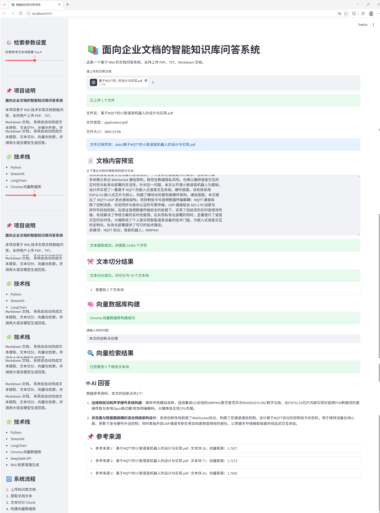

# 面向企业文档的智能知识库问答系统

## 一、项目简介

本项目是一个基于 RAG（Retrieval-Augmented Generation，检索增强生成）技术的智能知识库问答系统，支持用户上传 PDF、TXT、Markdown 等文档，系统会自动完成文档解析、文本切分、向量化存储、相似度检索，并调用大语言模型生成基于文档内容的回答。

项目适用于企业制度文档问答、毕业论文内容问答、产品说明书问答、学习资料检索和项目文档知识库助手等场景。

## 二、项目功能

- 支持 PDF、TXT、Markdown 文档上传
- 支持文档内容自动提取
- 支持长文本切分 Chunk
- 支持基于 Chroma 的向量数据库构建
- 支持基于问题的相关文本块检索
- 支持调用 DeepSeek API 生成智能回答
- 支持展示回答参考来源
- 支持 Top K 检索参数调节
- 支持 Streamlit 可视化交互页面

## 三、技术栈

- Python
- Streamlit
- LangChain
- Chroma 向量数据库
- DeepSeek API
- pypdf
- python-dotenv
- RAG 检索增强生成

## 四、系统流程

```text
用户上传文档
↓
系统提取文本内容
↓
文本切分为多个 Chunk
↓
构建 Chroma 向量数据库
↓
用户输入问题
↓
系统检索相关文本块
↓
调用 DeepSeek 大模型生成回答
↓
展示 AI 回答与参考来源
```

## 五、项目亮点

1. 基于 RAG 技术实现私有文档问答，减少大模型幻觉问题。
2. 使用 Chroma 向量数据库完成文档语义检索。
3. 结合 DeepSeek API 实现自然语言回答生成。
4. 支持参考来源展示，提高回答结果的可追溯性。
5. 支持 Top K 参数调节，适配简单问答和综合分析场景。
6. 使用 Streamlit 搭建可视化页面，便于演示和部署。

## 六、项目结构

```text
rag_knowledge_assistant/
├── app.py                 # 项目主程序
├── requirements.txt       # 项目依赖
├── README.md              # 项目说明文档
├── .env                   # API Key 配置文件，不上传 GitHub
├── .gitignore             # Git 忽略文件配置
├── data/                  # 上传文档保存目录
└── .venv/                 # Python 虚拟环境
```

## 七、环境配置

### 1. 创建虚拟环境

```bash
py -3.11 -m venv .venv
```

### 2. 激活虚拟环境

```bash
.venv\Scripts\activate
```

### 3. 安装依赖

```bash
pip install -r requirements.txt
```

### 4. 配置环境变量

在项目根目录创建 `.env` 文件：

```env
OPENAI_API_KEY=你的 DeepSeek API Key
OPENAI_BASE_URL=https://api.deepseek.com
MODEL_NAME=deepseek-chat
```

注意：`.env` 文件中包含 API Key，不要上传到 GitHub。

## 八、运行项目

在项目根目录下执行：

```bash
streamlit run app.py
```

运行成功后，浏览器访问：

```text
http://localhost:8501
```

如果浏览器没有自动打开，可以手动复制上面的地址访问。

## 九、测试示例

上传毕业论文、企业制度文档、产品说明书或学习资料后，可以测试以下问题：

```text
本文的研究背景是什么？
本文的创新点有几个？
本文使用 MQTT 的原因是什么？
本文的系统主要功能有哪些？
致谢部分我的导师是谁？
这份文档主要讲了什么？
请总结本文的主要内容。
```

系统会根据上传文档内容进行检索，并调用大语言模型生成回答，同时展示对应的参考来源。

## 十、项目总结

本项目实现了一个完整的 RAG 文档问答系统，涵盖文档上传、文本解析、文本切分、向量数据库构建、相似度检索、大模型回答生成和参考来源展示等核心流程。

通过该项目，可以较好地展示以下能力：

- Python 项目开发能力
- Streamlit 可视化应用开发能力
- LangChain 基础使用能力
- Chroma 向量数据库使用能力
- RAG 检索增强生成技术理解
- 大语言模型 API 调用能力
- Prompt 设计与优化能力
- 项目文档编写与 GitHub 项目展示能力

后续可以继续优化的方向包括：

1. 接入更专业的 Embedding 模型，提高语义检索准确率。
2. 支持 Word、Excel、网页等更多类型的数据源。
3. 增加用户登录和多知识库管理功能。
4. 增加聊天历史记录和多轮问答能力。
5. 支持将项目部署到云服务器或 Streamlit Cloud。
6. 增加更美观的前端页面和项目展示效果。
## 十一、项目界面展示

### 1. 文档上传与知识库构建页面

展示系统支持上传 PDF 文档，并自动完成文本提取、文本切分和向量数据库构建。

